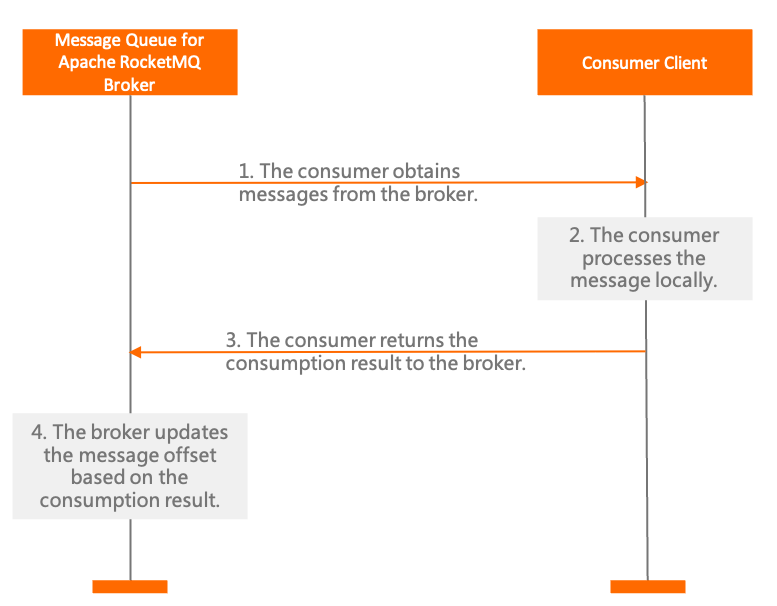

# 消费者分类

Apache RocketMQ 支持 PushConsumer 、 SimpleConsumer 以及 PullConsumer 这三种类型的消费者，本文分别从使用方式、实现原理、可靠性重试和适用场景等方面为您介绍这三种类型的消费者。

## 背景信息

Apache RocketMQ 面向不同的业务场景提供了不同消费者类型，每种消费者类型的集成方式和控制方式都不一样。了解如下问题，可以帮助您选择更匹配业务场景的消费者类型。

* 如何实现并发消费：消费者如何使用并发的多线程机制处理消息，以此提高消息处理效率？

* 如何实现同步、异步消息处理：对于不同的集成场景，消费者获取消息后可能会将消息异步分发到业务逻辑中处理，此时，消息异步化处理如何实现？

* 如何实现消息可靠处理：消费者处理消息时如何返回响应结果？如何在消息异常情况进行重试，保证消息的可靠处理？

以上问题的具体答案，请参考下文。

## 功能概述



如上图所示， Apache RocketMQ 的消费者处理消息时主要经过以下阶段：消息获取---\>消息处理---\>消费状态提交。

针对以上几个阶段，Apache RocketMQ 提供了不同的消费者类型： PushConsumer 、SimpleConsumer 和 PullConsumer。这几种类型的消费者通过不同的实现方式和接口可满足您在不同业务场景下的消费需求。具体差异如下：

:::info

在实际使用场景中，PullConsumer 仅推荐在流处理框架中集成使用，大多数消息收发场景使用 PushConsumer 和 SimpleConsumer 就可以满足需求。 

若您的业务场景发生变更，或您当前使用的消费者类型不适合当前业务，您可以选择在 PushConsumer 和SimpleConsumer 之间变更消费者类型。变更消费者类型不影响当前Apache RocketMQ 资源的使用和业务处理。

:::

:::danger
生产环境中相同的 ConsumerGroup 下严禁混用 PullConsumer 和其他两种消费者，否则会导致消息消费异常。
:::

|   对比项   |             PushConsumer             |       SimpleConsumer       | PullConsumer |
|---------|--------------------------------------|----------------------------|-------------------------|
| 接口方式    | 使用监听器回调接口返回消费结果，消费者仅允许在监听器范围内处理消费逻辑。 | 业务方自行实现消息处理，并主动调用接口返回消费结果。 |业务方自行按队列拉取消息，并可选择性地提交消费结果|
| 消费并发度管理 | 由SDK管理消费并发度。                         | 由业务方消费逻辑自行管理消费线程。          |由业务方消费逻辑自行管理消费线程。|
|负载均衡粒度| 5.0 SDK是消息粒度，更均衡，早期版本是队列维度| 消息粒度，更均衡| 队列粒度，吞吐攒批性能更好，但容易不均衡|
| 接口灵活度   | 高度封装，不够灵活。                           | 原子接口，可灵活自定义。               |原子接口，可灵活自定义。|
| 适用场景    | 适用于无自定义流程的业务消息开发场景。                      | 适用于需要高度自定义业务流程的业务开发场景。       |仅推荐在流处理框架场景下集成使用|


## PushConsumer 


PushConsumers是一种高度封装的消费者类型，消费消息仅通过消费监听器处理业务并返回消费结果。消息的获取、消费状态提交以及消费重试都通过 Apache RocketMQ 的客户端SDK完成。

**使用方式**

PushConsumer的使用方式比较固定，在消费者初始化时注册一个消费监听器，并在消费监听器内部实现消息处理逻辑。由 Apache RocketMQ 的SDK在后台完成消息获取、触发监听器调用以及进行消息重试处理。

示例代码如下：

```java
//消费示例：使用PushConsumer消费普通消息。
ClientServiceProvider provider = ClientServiceProvider.loadService();
        String topic = "Your Topic";
        FilterExpression filterExpression = new FilterExpression("Your Filter Tag", FilterExpressionType.TAG);
        PushConsumer pushConsumer = provider.newPushConsumerBuilder()
                //设置消费者分组。
                .setConsumerGroup("Your ConsumerGroup")
                //设置接入点。
                .setClientConfiguration(ClientConfiguration.newBuilder().setEndpoints("Your Endpoint").build())
                //设置预绑定的订阅关系。
                .setSubscriptionExpressions(Collections.singletonMap(topic, filterExpression))
                //设置消费监听器。
                .setMessageListener(new MessageListener() {
                    @Override
                    public ConsumeResult consume(MessageView messageView) {
                        //消费消息并返回处理结果。
                        return ConsumeResult.SUCCESS;
                    }
                })
                .build();
                
```

PushConsumer的消费监听器执行结果分为以下三种情况：

* 返回消费成功：以Java SDK为例，返回`ConsumeResult.SUCCESS`，表示该消息处理成功，服务端按照消费结果更新消费进度。

* 返回消费失败：以Java SDK为例，返回`ConsumeResult.FAILURE`，表示该消息处理失败，需要根据消费重试逻辑判断是否进行重试消费。

* 出现非预期失败：例如抛异常等行为，该结果按照消费失败处理，需要根据消费重试逻辑判断是否进行重试消费。


PushConsumer 消费消息时，若消息处理逻辑出现预期之外的阻塞导致消息处理一直无法执行成功，SDK会按照消费超时处理强制提交消费失败结果，并按照消费重试逻辑进行处理。消息超时，请参见[PushConsumer消费重试策略](./10consumerretrypolicy.md)。

:::info
出现消费超时情况时，SDK虽然提交消费失败结果，但是当前消费线程可能仍然无法响应中断，还会继续处理消息。
:::

**内部原理**

在PushConsumer类型中，消息的实时处理能力是基于SDK内部的典型Reactor线程模型实现的。如下图所示，SDK内置了一个长轮询线程，先将消息异步拉取到SDK内置的缓存队列中，再分别提交到消费线程中，触发监听器执行本地消费逻辑。


可靠性重试

PushConsumer 消费者类型中，客户端SDK和消费逻辑的唯一边界是消费监听器接口。客户端SDK严格按照监听器的返回结果判断消息是否消费成功，并做可靠性重试。所有消息必须以同步方式进行消费处理，并在监听器接口结束时返回调用结果，不允许再做异步化分发。消息重试具体信息，请参见[PushConsumer消费重试策略](./10consumerretrypolicy.md)。

使用PushConsumer消费者消费时，不允许使用以下方式处理消息，否则 Apache RocketMQ 无法保证消息的可靠性。

* 错误方式一：消息还未处理完成，就提前返回消费成功结果。此时如果消息消费失败，Apache RocketMQ 服务端是无法感知的，因此不会进行消费重试。

* 错误方式二：在消费监听器内将消息再次分发到自定义的其他线程，消费监听器提前返回消费结果。此时如果消息消费失败，Apache RocketMQ 服务端同样无法感知，因此也不会进行消费重试。

顺序性保障

基于 Apache RocketMQ
[顺序消息](./03fifomessage.md)的定义，如果消费者分组设置了顺序消费模式，则PushConsumer在触发消费监听器时，严格遵循消息的先后顺序。业务处理逻辑无感知即可保证消息的消费顺序。

:::info
消息消费按照顺序处理的前提是遵循同步提交原则，如果业务逻辑自定义实现了异步分发，则Apache RocketMQ 无法保证消息的顺序性。
:::

适用场景

PushConsumer严格限制了消息同步处理及每条消息的处理超时时间，适用于以下场景：

* 消息处理时间可预估：如果不确定消息处理耗时，经常有预期之外的长时间耗时的消息，PushConsumer的可靠性保证会频繁触发消息重试机制造成大量重复消息。

* 无异步化、高级定制场景：PushConsumer限制了消费逻辑的线程模型，由客户端SDK内部按最大吞吐量触发消息处理。该模型开发逻辑简单，但是不允许使用异步化和自定义处理流程。


## SimpleConsumer

SimpleConsumer 是一种接口原子型的消费者类型，消息的获取、消费状态提交以及消费重试都是通过消费者业务逻辑主动发起调用完成。

**使用方式**

SimpleConsumer 的使用涉及多个接口调用，由业务逻辑按需调用接口获取消息，然后分发给业务线程处理消息，最后按照处理的结果调用提交接口，返回服务端当前消息的处理结果。示例如下：

```java
 //消费示例：使用SimpleConsumer消费普通消息，主动获取消息处理并提交。
        ClientServiceProvider provider1 = ClientServiceProvider.loadService();
        String topic1 = "Your Topic";
        FilterExpression filterExpression1 = new FilterExpression("Your Filter Tag", FilterExpressionType.TAG);
        SimpleConsumer simpleConsumer = provider1.newSimpleConsumerBuilder()
                //设置消费者分组。
                .setConsumerGroup("Your ConsumerGroup")
                //设置接入点。
                .setClientConfiguration(ClientConfiguration.newBuilder().setEndpoints("Your Endpoint").build())
                //设置预绑定的订阅关系。
                .setSubscriptionExpressions(Collections.singletonMap(topic, filterExpression))
                //设置从服务端接受消息的最大等待时间
                .setAwaitDuration(Duration.ofSeconds(1))
                .build();
        List<MessageView> messageViewList = null;
        try {
            //SimpleConsumer需要主动获取消息，并处理。
            messageViewList = simpleConsumer.receive(10, Duration.ofSeconds(30));
            messageViewList.forEach(messageView -> {
                System.out.println(messageView);
                //消费处理完成后，需要主动调用ACK提交消费结果。
                try {
                    simpleConsumer.ack(messageView);
                } catch (ClientException e) {
                    e.printStackTrace();
                }
            });
        } catch (ClientException e) {
            //如果遇到系统流控等原因造成拉取失败，需要重新发起获取消息请求。
            e.printStackTrace();
        }
```

SimpleConsumer主要涉及以下几个接口行为：


|           接口名称            |                                                               主要作用                                                                |                                                                                                                                                                            可修改参数                                                                                                                                                                            |
|---------------------------|-----------------------------------------------------------------------------------------------------------------------------------|-------------------------------------------------------------------------------------------------------------------------------------------------------------------------------------------------------------------------------------------------------------------------------------------------------------------------------------------------------------|
| `ReceiveMessage`          | 消费者主动调用该接口从服务端获取消息。 **说明** 由于服务端存储为分布式，可能会出现服务端实际有消息，但是返回为空的现象。 一般可通过重新发起ReceiveMessage调用或提高ReceiveMessage的并发度解决。 | * 批量拉取消息数：SimpleConsumer可以一次性批量获取多条消息实现批量消费，该接口可修改批量获取的消息数量。  * 消费不可见时间：消息的最长处理耗时，该参数用于控制消费失败时的消息重试间隔。具体信息，请参见[SimpleConsumer消费重试策略](./10consumerretrypolicy.md)。消费者调用`ReceiveMessage`接口时需要指定消费不可见时间。   |
| `AckMessage`              | 消费者成功消费消息后，主动调用该接口向服务端返回消费成功响应。                                                                                                   | 无                                                                                                                                                                                                                                                                                                                                                           |
| `ChangeInvisibleDuration` | 消费重试场景下，消费者可通过该接口修改消息处理时长，即控制消息的重试间隔。                                                                                             | 消费不可见时间：调用本接口可修改`ReceiveMessage`接口预设的消费不可见时间的参数值。一般用于需要延长消息处理时长的场景。                                                                                                                                                                                                                                                                    |


**可靠性重试**

SimpleConsumer消费者类型中，客户端SDK和服务端通过`ReceiveMessage`和`AckMessage`接口通信。客户端SDK如果处理消息成功则调用`AckMessage`接口；如果处理失败只需要不回复ACK响应，即可在定义的消费不可见时间到达后触发消费重试流程。更多信息，请参见[SimpleConsumer消费重试策略](./10consumerretrypolicy.md)。

**顺序性保障**

基于 Apache RocketMQ [顺序消息](./03fifomessage.md)的定义，SimpleConsumer在处理顺序消息时，会按照消息存储的先后顺序获取消息。即需要保持顺序的一组消息中，如果前面的消息未处理完成，则无法获取到后面的消息。

适用场景

SimpleConsumer提供原子接口，用于消息获取和提交消费结果，相对于PushConsumer方式更加灵活。SimpleConsumer适用于以下场景：

* 消息处理时长不可控：如果消息处理时长无法预估，经常有长时间耗时的消息处理情况。建议使用SimpleConsumer消费类型，可以在消费时自定义消息的预估处理时长，若实际业务中预估的消息处理时长不符合预期，也可以通过接口提前修改。

* 需要异步化、批量消费等高级定制场景：SimpleConsumer在SDK内部没有复杂的线程封装，完全由业务逻辑自由定制，可以实现异步分发、批量消费等高级定制场景。

* 需要自定义消费速率：SimpleConsumer是由业务逻辑主动调用接口获取消息，因此可以自由调整获取消息的频率，自定义控制消费速率。

## PullConsumer

待补充。。


## 使用建议

**PushConsumer合理控制消费耗时，避免无限阻塞**

对于PushConsumer消费类型，需要严格控制消息的消费耗时，尽量避免出现消息处理超时导致消息重复。如果业务经常会出现一些预期外的长时间耗时的消息，建议使用SimpleConsumer，并设置好消费不可见时间。
